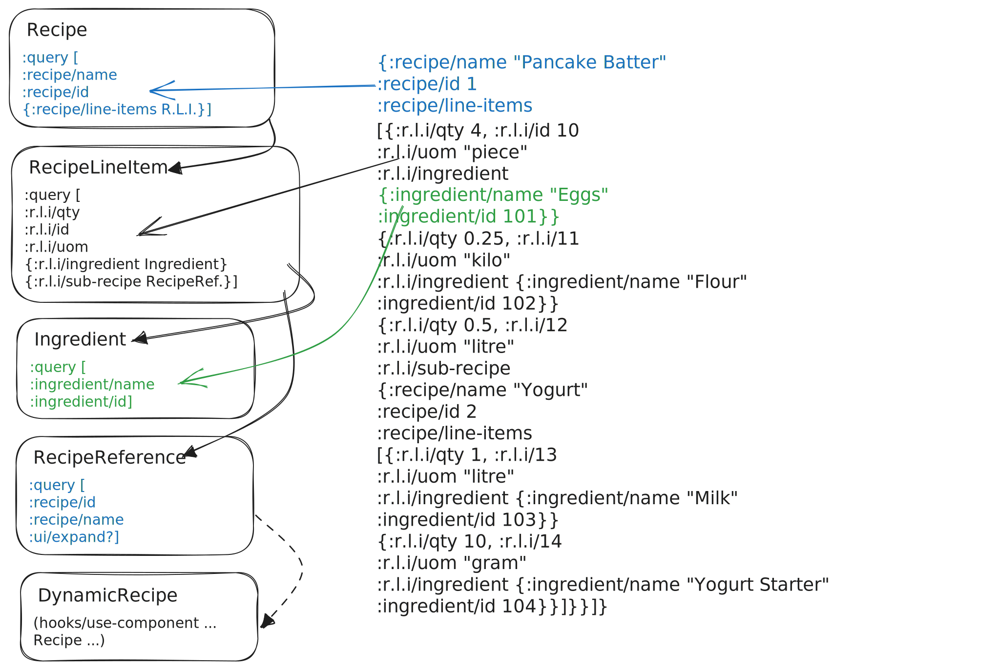
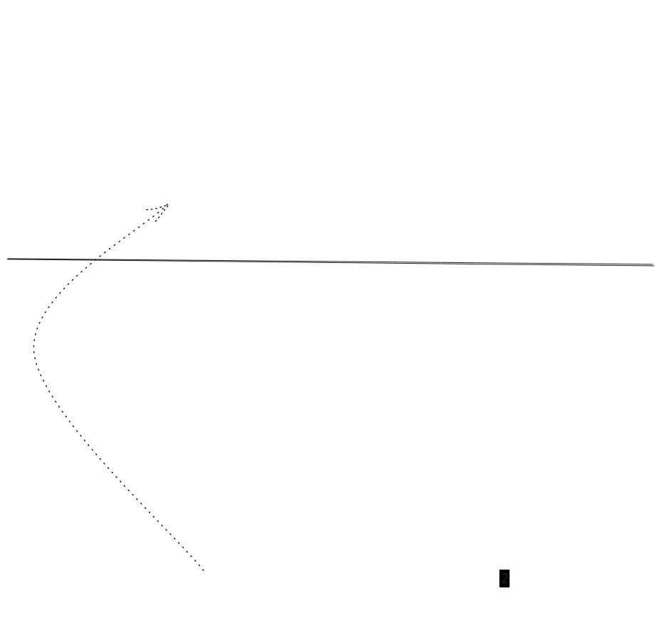

[#dynamic-recursion]
=== Solving mutually recursive elements with lazy loading with hooks and dynamic components
:stylesheet: cookbook.css
:source-highlighter: coderay
// :kroki-fetch-diagram:
// breaks Kroki in VS Code :'(

// FIXME: No highlighter seems to be working with at least the asciidoctor docker image
// :source-highlighter: highlight.js
// :highlightjs-languages: clojure

==== The goal

You have a recursive data structure you need to display in a way that matches the data hierarchy. 

For example:

. A file system, folders with arbitrary depth, and files. 
. A tree of comments. 
. A recipe that contains other recipes.

There are different ways to address this in Fulcro, depending on the concrete use case. Next, we will explore a particular one.

==== The concrete problem

You have recipes containing line items, which further contain either an ingredient or a sub-recipe. This nesting can go on arbitrarily. Think pizza with sauce -> the sauce has sub-components. Sub-components, in turn, might have final ingredients (salt, oil, pepper). Line items also hold the element's quantity `qty` and unit of measure `uom`. In other words, we have two mutually recursive elements - a recipe and its line item.

In this particular case, we also want to lazyload the sub-recipes so we don't load the entire tree up front. That further complicates the usage of EQL recursive queries. (Though it could be achieved by leveraging a depth limit on the recursive query.)

Let's look at the UI we want and the data we have:

.The desired UI
image::./recipes-ui.svg["UI wireframes",35%,opts=inline]

And the data:

.The data model in our SQL database
ifdef::env-github[image::data-model.png[Data model]]
ifndef::env-github[]
[plantuml,data-model,png]
.... 
@startuml
entity Recipe {
  id : string
  name : string
  line-items : [RecipeLineItem]
}
entity RecipeLineItem {
  id : string
  qty : number
  uom : litre|piece|teaspoon|...
  ingredient : Ingredient
  sub-recipe : Recipe
}
entity Ingredient {
  id : string
  name : string
}
Recipe "1" *- "+" RecipeLineItem
RecipeLineItem o- "0..1" Recipe
RecipeLineItem o- "0..1" Ingredient
@enduml
....

.Thus we get the data tree below:
[source,clojure]
----
{:recipe/name "Pancake Batter" :recipe/id "1"
 :recipe/line-items
 [{:r.l.i/id "10" ; <1>
   :r.l.i/qty 4, :r.l.i/uom "piece"
   :r.l.i/ingredient {:ingredient/name "Eggs", :ingredient/id "101"}}
  {:r.l.i/id "11"
   :r.l.i/qty 0.25, :r.l.i/uom "kilo"
   :r.l.i/ingredient {:ingredient/name "Flour", :ingredient/id "102"}}
  {:r.l.i/id "12"
   :r.l.i/qty 0.5, :r.l.i/uom "litre"
   :r.l.i/sub-recipe
   {:recipe/name "Yogurt" :recipe/id "2"
    :recipe/line-items
    [{:r.l.i/id "13"
      :r.l.i/qty 1, :r.l.i/uom "litre"
      :r.l.i/ingredient {:ingredient/name "Milk", :ingredient/id "103"}}
     {:r.l.i/id "14"
      :r.l.i/qty 10, :r.l.i/uom "gram"
      :r.l.i/ingredient {:ingredient/name "Yogurt Starter", :ingredient/id "104"}}]}}]}
----
<1> :r.l.i/ stands for :recipe-line-item/, for space efficiency

==== Exploring possible solutions

The standard solution to loading data for recursive components is to use a https://edn-query-language.org/eql/1.0.0/specification.html#_recursive_queries[recursive query in EQL]. It can load either the entire recursive tree or a particular number of levels. The EQL solution is the most straightforward and covers 95% of all cases.

TIP: A recursive EQL query for e.g. folders would look like this: `[:folder/id :folder/name :folder/children ...]` (the `...` indicates the self-recursion).

However, some cases are just too complex to solve with EQL recursive queries. This approach requires that the same entity be present at each level of traversal, i.e. we have a single component that may contain itself. That is not the case here, where we have Recipe containing RecipeLineItem, containing Recipe ... .

===== Option A: Flatten the data to get a self-recursive element

We could change our data model so that a recipe contains directly sub-recipes, for example by separating and storing separately the qty and uom data and the sub-recipes themselves:

[source,clojure]
----
{:recipe/name "Pancake Batter" :recipe/id "1"
 :recipe/line-items [{:r.l.i/qty 4 :r.l.i/uom "piece"
                      :r.l.i/ingredient {:ingredient/name "Eggs", :ingredient/id "101"}}
                     {:r.l.i/qty 0.5 :r.l.i/uom "litre" ; <1>
                      :r.l.i/sub-recipe [:recipe/id "2"]}]
 :recipe/sub-recipes [{:recipe/id "2" ; <2>
                       :recipe/name "Yogurt"
                       :recipe/line-items [...]}]}
----
<1> The line-item information (uom, qty) for Yogurt
<2> The Yogurt sub-recipe itself

Then inside the component you would join the two pieces of data together, at render time.

It might not be elegant, but it gets the job done.

===== Option B: Use a dynamic, hook-based component to load the sub-recipe

In this case, we have also the additional requirement of lazy loading of sub-recipes. We can solve both problems by using a dynamic component, i.e. one that is not part of the query tree but gets its data independently, via the `use-component` hook.

TIP: Dynamic use-component components provide great flexibility, at the cost of increased complexity and decreased transparency (since the UI isn't anymore a pure function of data, passed from the parent).

What we will do is load a Recipe that has a RecipeLineItem that _refers_ to a Recipe (just the ID and name, avoiding the problematic recursive line items). We then swap out the reference for a dynamically loaded entity when the user wants to see the details of the sub-recipe.

===== The solution

We will adopt solution B, using a dynamic hooks component.

Below we can see what the component instances will look like, for a recipe with three line items, where 1. is a collapsed sub-recipe, 2. is an expanded sub-recipe, and 3. is an ingredient: 

.The UI components
ifdef::env-github[image::components.png[Data model]]
ifndef::env-github[]
[plantuml,components,png]
.... 
@startuml
component "Recipe" {

  component "RecipeLineItem 3" {
    json Ingredient {
      "id": "101",
      "name": "Eggs"
    }
  }

  component "RecipeLineItem 2" {
    component "RecipeReference 2" {
      component "DynamicRecipe" {
        json Recipe_2 {
        "id": "2",
        "name": "M. Yogurt",
        "line-items": "..."
        }
      }
    }
  }

  component "RecipeLineItem 1" {
    json RecipeReference_1 {
        "id": "3",
        "name": "M. Berries",
        "ui/expand?": false
      }
  }
}
@enduml
....

Notice that the `RecipeReference` component in its collapsed state only displays the name of the sub-recipe, while in its expanded state it renders a `DynamicRecipe` component with the complete sub-recipe.

Below, on the left, we can see the "render tree" of components with their _queries_ (actually, query fragments). The solid head arrows ▶ show both query inclusion and component nesting. On the right, we can see the corresponding data tree, and how it matches the query fragments (the hollow head arrows >).

[.small]#Note: The queries have been abbreviated to save space. Thus, for instance, `{:recipe/line-items R.L.I.}` should be read as `{:recipe/line-items (comp/get-query RecipeLineItem)}`.#

.The render tree and corresponding data tree

We now understand the structure of our components and the data tree, and can explore how the data is loaded:

.Data loading

We can see that the initial `df/load!` only loads the id and name of the Yogurt sub-recipe. When the user expands it, it triggers an additional load, to fetch the remaining data of the recipe.

TIP: There could be a small complication with the on-demand loading of the sub-recipe. The reason is that the `use-component` hook is slightly tricky to use with something that has yet to be loaded, since it needs some data to exist in the client DB. I.e. <entity> <id> must not be undefined/nil, it must be at least an empty map (or rather, a map with an id). We could initialize the `DynamicRecipe` component via `:initial-params` together with specifying `:initial-state` for the `Recipe` so that the hook could then make an "empty" but properly identified placeholder in the database to hook up to while the load runs. I.e., `use-component` with `:initial-params` generates a `{:recipe/id n}` map and normalizes it (which puts the ident in place for finding it as well). Then the load gets issued. When the details arrive, you've got the full recipe.
Fortunately, in our case this is not required, because the parent recipe-line-item has already loaded the name and ID of the recipe in question (just not its line items). 

===== Insights

.Power and downsides of use-component
****
If a static query doesn't work for your recursive component needs, then the options are dynamic queries or breaking out of the standard Fulcro model by leveraging a use-component hook.
Recursive queries work in 95% of cases, dynamic queries works in a few more, and use-component covers the rest.

You could ask, if I can do everything with use-component, then why not just supply that and drop the components and static queries altogether?

Because the static query mechanism offers a few advantages:

* Possibility to define a global initial data model locally, component by component, via its `:initial-state`, instead of doing it at some remote place or using component-local state
* Side-effects combined with rendering (i.e., what most React hooks do) cause problems:
 ** Hot code reload doesn't work cleanly since components aren't pure functions anymore
 ** Controlling the data lifecycle becomes more difficult because it is tied to when things are mounted as opposed to compositional logic outside of rendering.
 ** Refactoring UI breaks things (E.g., a side effect A did accidentally got coupled to B. Move A and B stops working)
* Easier to trace what is going on in the data model because it is more straightforward - each component gets its data only from its parent, and you can see what is the data tree going into the Root component
* The query itself becomes a valuable source of information (which we leverage e.g., for Dynamic Routing)
****

====== Complete code

Finally, let's look at some code! First of all, a few highlights. See the complete code listing at the bottom.

.DynamicRecipe
[source,clojure]
----
include::./dynamic_recursion_cards.cljs[tag=dynamic-recipe]
----

DynamicRecipe is a hooks-based component `(1)`, which "fetches" data from the client DB via `hooks/use-component` `(2)`. Notice that we need to tell Fulcro its `:ident` `(3)` since the component has a dynamic one. In this case, we already know that there is some data for the ident in the client DB (namely id, name), so we do not need to initialize it. Alternatively, we could leave `:initialize? true` (the default) but would then need to provide the `:recipe/id` via `:initial-params`, and perhaps also include `:keep-existing? true`. Though in this particular case, our initialization would only be overriding `:name`, and we are going to re-load it at once, so it doesn't really matter.

As the component is mounted in the DOM, its `use-lifecycle` will fire a `df/load!` `(4)` to load the remaining data. If we used a true remote server and a slower network, you could see that the expanded Recipe only has initially id, name, until the rest of the data arrives.

.RecipeReference
[source,clojure]
----
include::./dynamic_recursion_cards.cljs[tag=recipe-ref]
----

RecipeReference displays either the name of the recipe when collapsed, or renders a DynamicRecipe when expanded.

Finally, here is the complete code listing:

.dynamic-recursion-cards
====
//include::https://raw.githubusercontent.com/fulcrologic/fulcro/c6c490b6e4a5461628bd940a5c6b067ee002775a/src/workspaces/com/fulcrologic/fulcro/cards/dynamic_recursion_cards.cljs[] 
[source,clojure]
----
include::./dynamic_recursion_cards.cljs[]
----
====